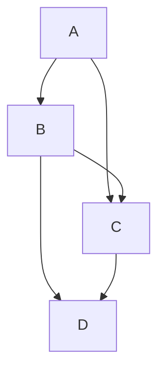

# Esta es la cabecera del repositorio prueba
## Esto es la segunda cabecera del repositorio
### Esta es la tercera cabecera del repositorio

Este es el **contenido** del repositorio *prueba*

Veamos ahora los tipos de tabla que hay

-----------------**Desordenadas**-----------------
- Opcion 1
- Opcion 2
- Opcion 3

-----------------**Ordenadas**-----------------
1. Opcion 1
2. Opcion 2
3. Opcion 3

-----------------**Anidada**-----------------
1. Opcion 1
- Subopcion1
- Subopcion2
2. Opcion 2

-----------------**Tabla**-----------------
|Columna1|Columna2|
|----------|----------|
|Contenido1|Contenido2|
|Contenido3|Contenido4|

-----------------**Grafico**-----------------

